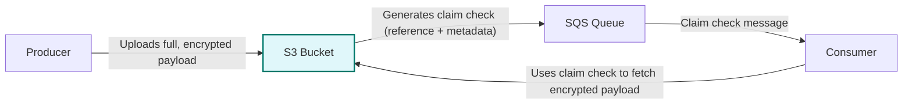

# 📐 Architecture: S3 to SQS Claim Check Pattern

## Overview

This module implements the [Claim Check pattern](https://docs.microsoft.com/en-us/azure/architecture/patterns/claim-check) using AWS services. The pattern is designed for scenarios where large or sensitive payloads need to be processed asynchronously, but message size limits or security requirements prevent sending the full payload through a message queue.

## Components

- **Amazon S3**: Stores large or sensitive payloads securely using server-side encryption (SSE-KMS).
- **Amazon SQS**: Receives lightweight messages containing references (claim checks) to the payloads stored in S3.
- **AWS KMS**: Manages encryption keys for both S3 and SQS, ensuring data is encrypted at rest.
- **IAM Policies**: Restrict access to only the necessary resources and actions for secure operation.

## Flow Diagram



- The **Producer** uploads the original, encrypted data to the S3 bucket.
- The **S3 bucket** (or the application after upload) generates a claim check (reference and metadata) and sends only this lightweight packet to the **SQS queue**.
- The **Consumer** reads the claim check from SQS and uses it to fetch the encrypted payload from S3.
- The original data remains encrypted in S3 at all times.

## Security

- **Encryption at Rest**: Both S3 and SQS use KMS-managed keys for encryption.
- **Encryption in Transit**: All communication uses HTTPS/TLS.
- **IAM Policies**: Least-privilege access for producers and consumers.

## Extensibility

- **Multiple Environments**: Supports `dev`, `staging`, `prod`, etc.
- **Custom Tags**: Apply organization-specific tags to all resources.
- **KMS Key Management**: Optionally create a new KMS key or use an existing one.

## Example Message

```json
{
  "s3_bucket": "dev-claimcheck-bucket",
  "s3_key": "payloads/2025-08-06/uuid.json",
  "metadata": {
    "submitted_by": "service-A",
    "timestamp": "2025-08-06T12:34:56Z"
  }
}
```

---

For more details, see the [README.md](../README.md).